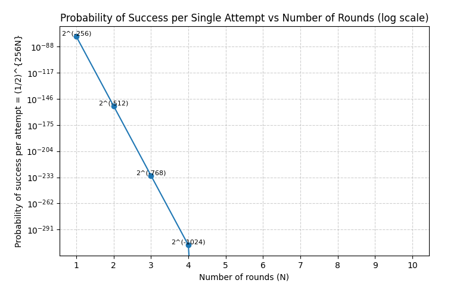

#  NPK Schnorr Authentication Library

## Overview

This project is based on **NPK (Non-Interactive Proofs of Knowledge) using Schnorr signatures**, providing a robust cryptographic framework for zero-knowledge authentication in distributed systems. The library implements the Schnorr protocol with Fiat-Shamir transformation to enable non-interactive proofs of knowledge, suitable for blockchain applications, secure messaging, and decentralized identity systems.

---

##  Project Goals

This library aims to make **NPK Schnorr authentication accessible to all developers** by providing a simple, Pythonic API that abstracts away the cryptographic complexity. Our goal is to enable anyone to build applications with **significantly more secure authentication** without requiring deep knowledge of elliptic curve cryptography or zero-knowledge proofs.

### Why This Library?

There's a significant gap between academic cryptography and practical tools for developers. While NPK Schnorr offers superior security properties compared to traditional password-based or JWT authentication, implementing it correctly requires expertise that most developers don't have. This library bridges that gap.

**Key advantages over traditional authentication**:
- **Zero-Knowledge**: Secrets never leave the client, even encrypted
- **No Password Database**: No credentials to steal or leak
- **Replay Attack Resistant**: Built-in protection through context binding
- **Non-Interactive**: Generate proof once, verify anywhere
- **Quantum-Resistant Security Margins**: Multiple rounds provide defense-in-depth

### Simple API Design

```python
from easyzkp import ...

#currently working on functions
```

**Complex cryptography, simple interface.** All the mathematical complexity—nonce generation, challenge computation, context binding, multi-round execution is handled automatically while remaining configurable for advanced users.

### Target Use Cases

- **API Authentication**: Replace JWT tokens with zero-knowledge proofs
- **Distributed Systems**: Authenticate without interactive round-trips
- **IoT Devices**: Offline authentication with minimal overhead
- **Blockchain & DApps**: Cryptographically strong wallet authentication
- **Secure Messaging**: End-to-end identity verification
- **Microservices**: Stateless authentication without password databases

##  Non-Interactive Proofs of Knowledge (NPK)

Non-Interactive Proofs of Knowledge allow a prover to demonstrate knowledge of a secret $x$ without revealing it or requiring interaction with the verifier. This cryptographic primitive provides several critical advantages in modern distributed systems.

### Key Benefits

**Eliminating Interaction**: Traditional authentication protocols require multiple round-trips between prover and verifier. NPK eliminates this overhead, enabling asynchronous verification where the prover can generate a proof once and multiple verifiers can validate it independently.

**Reducing Exposure**: The secret $x$ is never transmitted over the network, not even in encrypted form. This fundamentally reduces the attack surface by ensuring that even if all network traffic is compromised, the secret remains secure.

**Enhancing Efficiency**: NPK proofs are particularly suitable for scenarios where interactive authentication is impractical, such as blockchain transactions, signed messages, IoT device authentication, and high-latency networks.

### Mathematical Foundation

In a Non-Interactive setting using the Fiat-Shamir transformation, the protocol works as follows:

$$c = H(R, \text{context})$$

$$s = k + c \cdot x \mod n$$

$$\text{Verification: } s \cdot G \stackrel{?}{=} R + c \cdot P$$

Where:
- $G$ is the base point (generator) on the elliptic curve
- $P = x \cdot G$ is the public key corresponding to the secret $x$
- $k$ is a cryptographically secure random nonce
- $R = k \cdot G$ is the commitment
- $H$ is a cryptographic hash function (e.g., SHA-256) used to generate the challenge $c$
- $n$ is the order of the elliptic curve group
- $\text{context}$ includes additional data (message, timestamp, etc.) to bind the proof to a specific use case

The Fiat-Shamir transformation replaces the interactive challenge from a verifier with a hash of the commitment and context, making the protocol non-interactive while preserving its security properties.

---

##  Schnorr Protocol

The Schnorr protocol is a Zero-Knowledge Proof system for proving knowledge of a discrete logarithm $x$ (the private key) without revealing any information about it beyond the fact that the prover knows it.

### Protocol Steps

1. **Commitment Phase**: The prover generates a random nonce $k$ and computes:
   $$R = k \cdot G$$
   
2. **Challenge Phase**: The verifier (or hash function in non-interactive mode) generates a challenge:
   $$c \in \{0,1\}^{256}$$
   
3. **Response Phase**: The prover computes:
   $$s = k + c \cdot x \mod n$$
   
4. **Verification Phase**: The verifier checks:
   $$s \cdot G \stackrel{?}{=} R + c \cdot P$$

### Security Analysis

The security of the Schnorr protocol relies on the computational hardness of the discrete logarithm problem on elliptic curves. For an attacker who does not know $x$, successfully forging a valid response requires either:

- Solving the discrete logarithm problem to recover $x$ from $P$
- Guessing the correct response $s$ for a given challenge $c$

The probability of successfully guessing a valid response for a single challenge without knowledge of $x$ is:

$$P_{\text{single round}} = \frac{1}{2^{256}} \approx 8.6 \times 10^{-78}$$

This probability is computationally negligible—far below any practical threshold for cryptographic security. For context, this is orders of magnitude smaller than the probability of:
- Finding a specific atom in the observable universe (~$10^{-80}$)
- Two randomly generated UUIDs colliding (~$10^{-38}$ for standard UUIDs)

---

##  Multi-Round Authentication

To further increase security margins or to meet specific security requirements, the Schnorr protocol can be executed multiple times with independent challenges. For $N$ rounds, each using an independent random nonce and challenge, the probability of an attacker successfully forging all rounds is:

$$P_{N} = \left(\frac{1}{2^{256}}\right)^N = \frac{1}{2^{256N}} = 2^{-256N}$$

### Security Scaling Table

| Rounds ($N$) | Effective Security | Probability of Success ($P_N$) |
|:------------:|:------------------:|:------------------------------:|
| 1            | 256 bits           | $2^{-256} \approx 8.6 \times 10^{-78}$ |
| 2            | 512 bits           | $2^{-512} \approx 7.4 \times 10^{-155}$ |
| 3            | 768 bits           | $2^{-768} \approx 5.4 \times 10^{-232}$ |
| 5            | 1280 bits          | $2^{-1280} \approx 2.7 \times 10^{-386}$ |

### Visual Analysis

The following graph illustrates the exponential decay of attack success probability as the number of authentication rounds increases. The y-axis uses a logarithmic scale to visualize the dramatic reduction in vulnerability:



As shown in the graph, the probability decreases exponentially following the formula $P_N = 2^{-256N}$, where each additional round multiplies the security by a factor of $2^{256}$. This visualization demonstrates why even a single round provides cryptographic security that exceeds any practical attack scenario, and multiple rounds offer defense-in-depth security margins that are astronomically beyond any conceivable threat.

### Practical Interpretation

Each authentication round independently adds 256 bits of cryptographic security. Even a minimal number of rounds makes the probability of a successful brute-force attack astronomically low—far beyond any conceivable computational capability, including quantum computers in the foreseeable future.

For example, with just 3 rounds:
$$P_3 = 2^{-768} \approx 5.4 \times 10^{-232}$$

This exceeds the security requirements for even the most sensitive cryptographic applications. Multiple rounds can be used when:
- Defense-in-depth is required for critical systems
- Protection against future cryptanalytic advances is desired
- Regulatory compliance mandates specific security levels

However, it's important to note that a single round already provides quantum-resistant security levels (assuming pre-quantum discrete log hardness), and multiple rounds primarily serve as additional safety margins rather than addressing specific known vulnerabilities.

---

##  Conclusion

The combination of **Non-Interactive Proofs of Knowledge** and **multi-round Schnorr authentication** provides:

 **Astronomically Low Attack Probability**: Even with quantum computing advances, the security margins remain beyond any practical threat model.

 **Zero-Knowledge Property**: The prover demonstrates knowledge of the secret $x$ without revealing any information about it, not even indirectly through the transcript of the protocol.

 **Non-Interactive Verification**: Proofs can be generated once and verified by multiple parties asynchronously, enabling efficient distributed authentication.

 **Flexible Security Levels**: The number of rounds can be adjusted based on specific security requirements, regulatory standards, or risk assessments.

 **Efficient Implementation**: Schnorr signatures are compact and computationally efficient, requiring only a few elliptic curve operations per round.

 **Post-Quantum Considerations**: While elliptic curve discrete logarithm is vulnerable to Shor's algorithm on large-scale quantum computers, the multi-round approach and potential use of hash-based commitments provide additional security layers.

This makes NPK Schnorr authentication ideal for:
- Blockchain and cryptocurrency wallets
- Decentralized identity systems
- IoT device authentication
- Smart contracts and DeFi protocols
- Secure messaging and communication systems
- Any scenario requiring strong, non-interactive authentication

---

##  References

- **Schnorr, C. P.** (1991). "Efficient Signature Generation by Smart Cards". *Journal of Cryptology*, 4(3), 161-174.
- **Fiat, A., & Shamir, A.** (1986). "How to Prove Yourself: Practical Solutions to Identification and Signature Problems". *CRYPTO 1986*.
- **Bernstein, D. J., et al.** (2012). "High-speed high-security signatures". *Journal of Cryptographic Engineering*, 2(2), 77-89.

---

